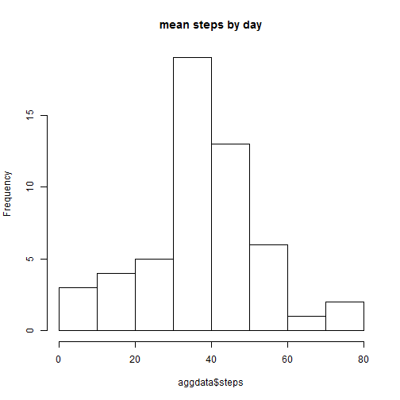
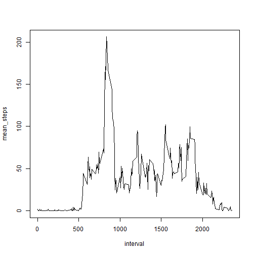
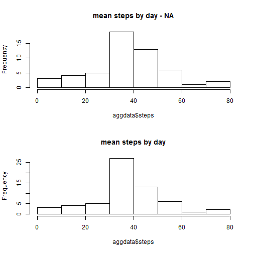
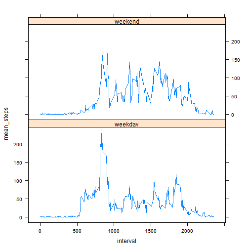

**LOADING AND PREPROCESSING THE DATA**

```r
library(dplyr)
```

```
## Warning: package 'dplyr' was built under R version 3.1.2
```

```
## 
## Attaching package: 'dplyr'
## 
## The following object is masked from 'package:stats':
## 
##     filter
## 
## The following objects are masked from 'package:base':
## 
##     intersect, setdiff, setequal, union
```

```r
library(tidyr)
```

```
## Warning: package 'tidyr' was built under R version 3.1.2
```

```r
library(lattice)

activity <- read.csv(unz("activity.zip", "activity.csv"), header=TRUE, stringsAsFactors=FALSE)
activity$date <- as.POSIXct(activity$date, format="%Y-%m-%d")
activity$dayofweek <- weekdays(activity$date, abbr = TRUE)
```

**WHAT IS MEAN TOTAL NUMBER OF STEPS TAKEN PER DAY?**

    What is mean total number of steps taken per day? (ignoring the missing values in the dataset)
    

```r
# Aggregates steps by date
aggdata <-aggregate(steps ~ date, data = activity, FUN = mean)
#activityCC <-  activity[complete.cases(activity),]
#aggdatamed <-aggregate(steps ~ date, data = activityCC, FUN = median, na.rm=TRUE)
# Hist mean steps by day
hist(aggdata$steps, main="mean steps by day")
```

 

```r
# Calculates the mean of steps of the dataset
meanstepsNA <- mean(na.omit(aggdata$steps))
#aggdata <-aggregate(steps ~ date, data = activity, FUN = median)
medianstepsNA <- median(na.omit(aggdata$steps))

meanstepsNA
```

```
## [1] 37.38
```

```r
medianstepsNA  #Review
```

```
## [1] 37.38
```

    *37.3826 mean total number of steps.*
    
**WHAT IS MEAN TOTAL NUMBER OF STEPS TAKEN PER DAY?**

    Make a time series plot (i.e. type = "l") of the 5-minute interval (x-axis) and the average number of steps taken, averaged across all days (y-axis)
  

```r
# Grouping by interval and summarizing mean by dates for plot (na removed)
by_interval <- group_by(activity, interval)
by_intervalmean <- summarize(by_interval, mean_steps = mean(steps, na.rm=TRUE))
#intervals <- strptime(sprintf("%04d", as.numeric(names(meanSteps))), format="%H%M")
with(by_intervalmean, plot(interval, mean_steps, type="l"))
```

 

    *0835 interval contains the maximum number of steps on average across all the days in the dataset.*

**IMPUTING MISSING VALUES**

    Calculate and report the total number of missing values in the dataset 
    

```r
missingvalues <- nrow(activity) - sum(complete.cases(activity))
```

    *The total number of missing values in the dataset is 2304*
    
    *We will use the mean per interval to fill the missing values in the dataset 
in a new dataset activity2*
    

```r
activity2 <- select(activity, steps, date, interval, dayofweek)

for(n in 1:nrow(activity2)) {
    
    index <- activity2[n,3]
    temp <- by_intervalmean[by_intervalmean$interval == index, ]
    if (is.na(activity2[n,1])) activity2[n,1] <- temp$mean_steps else flag <-                 0
    
}
```

    Make a histogram of the total number of steps taken each day and Calculate and report the mean and median total number of steps taken per day. 
    

```r
par(mfrow = c(2,1))
# With NAs
hist(aggdata$steps, main="mean steps by day - NA")
# NAs estimated as mean of Day
    # Aggregates steps by date
aggdata <-aggregate(steps ~ date, data = activity2, FUN = mean)
    # Hist mean steps by day
hist(aggdata$steps, main="mean steps by day")
```

 

```r
# Calculates the mean of steps of the dataset
meansteps <- mean(na.omit(aggdata$steps))
meansteps
```

```
## [1] 37.38
```

    Do these values differ from the estimates from the first part of the assignment? - *Yes.*
    
    What is the impact of imputing missing data on the estimates of the total daily number of steps? - *There is a difference in means with 37.3826 mean total number of steps (NAs estimated by mean) vs 37.3826 mean total number of steps.*

**ARE THERE DIFFERENCES IN ACTIVITY PATTERNS BETWEEN WEEKDAYS AND WEEKENDS?**

    1. Create a new factor variable in the dataset with two levels - "weekday" and "weekend" indicating whether a given date is a weekday or weekend day.
    

```r
#activity2 <- select(activity, steps, date, interval, dayofweek)
activity2[, "WKDorWND"] <- "weekday"
WKN <- activity2[ activity2$dayofweek %in% c("Sat","Sun"), ]
WKN[, "WKDorWND"] <- "weekend"
WKD <- activity2[ ! activity2$dayofweek %in% c("Sat","Sun"), ]
activity2 <- rbind(WKN,WKD)
activity2 <- arrange(activity2, date)

head(activity2)
```

```
##     steps       date interval dayofweek WKDorWND
## 1 1.71698 2012-10-01        0       Mon  weekday
## 2 0.33962 2012-10-01        5       Mon  weekday
## 3 0.13208 2012-10-01       10       Mon  weekday
## 4 0.15094 2012-10-01       15       Mon  weekday
## 5 0.07547 2012-10-01       20       Mon  weekday
## 6 2.09434 2012-10-01       25       Mon  weekday
```

    *See above for added column 'WKDorWND' for weekend or weekdays.*

    2. Make a panel plot containing a time series plot (i.e. type = "l") of the 5-minute interval (x-axis) and the average number of steps taken, averaged across all weekday days or weekend days (y-axis). 


```r
# Grouping by interval and summarizing mean by dates for plot (na removed)
activity2WD <- subset(activity2, WKDorWND=="weekday", select=steps:WKDorWND) 
by_interval2WD <- group_by(activity2WD, interval)
by_intervalmean2WD <- summarise(by_interval2WD, mean_steps = mean(steps, na.rm=TRUE))
by_intervalmean2WD$WKDorWND <- "weekday"

activity2WN <- subset(activity2, WKDorWND=="weekend", select=steps:WKDorWND) 
by_interval2WN <- group_by(activity2WN, interval)
by_intervalmean2WN <- summarise(by_interval2WN, mean_steps = mean(steps, na.rm=TRUE))
by_intervalmean2WN$WKDorWND <- "weekend"

by_intervalmean2b <- rbind(by_intervalmean2WD, by_intervalmean2WN)

xyplot(mean_steps ~ interval | WKDorWND, data = by_intervalmean2b, type='l',layout = c(1, 2))   
```

 

